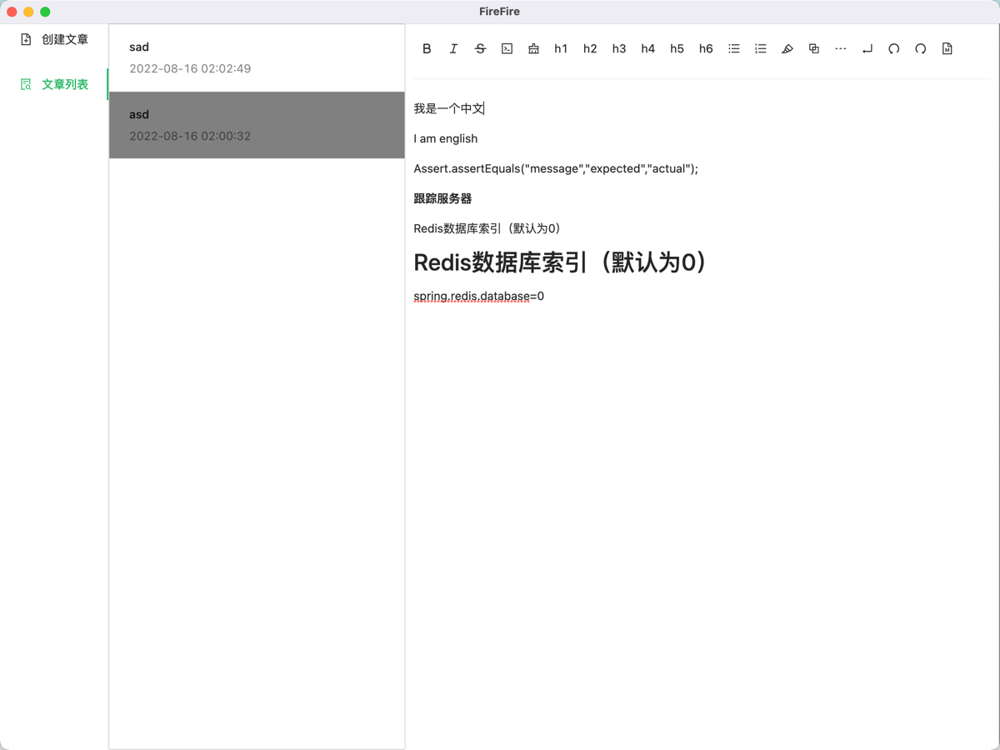

# FireFire
一款基于本地的笔记软件

# 更新日志
| 概要             | 详情 | 时间         |
|----------------|---|------------|
| 支持Markdown基本语法 | 支持Markdown基本语法 | 2022-08-14 |
| 支持本地文件操作       | 支持本地文件读写 | 2022-08-16 |

# 现已支持
* 支持Markdown基本语法
* 支持本地文件读写、支持创建文件

# 预计支持
* 支持右键删除文件、重命名文件
* 导入导出Markdown/HTML文件
* 标签功能
* 标签功能Graph
* 用户自定义设置功能
* 自定义颜色主题选择
* 支持webdav功能
* 支持BiliBili视频链接

# 界面

## 主界面

