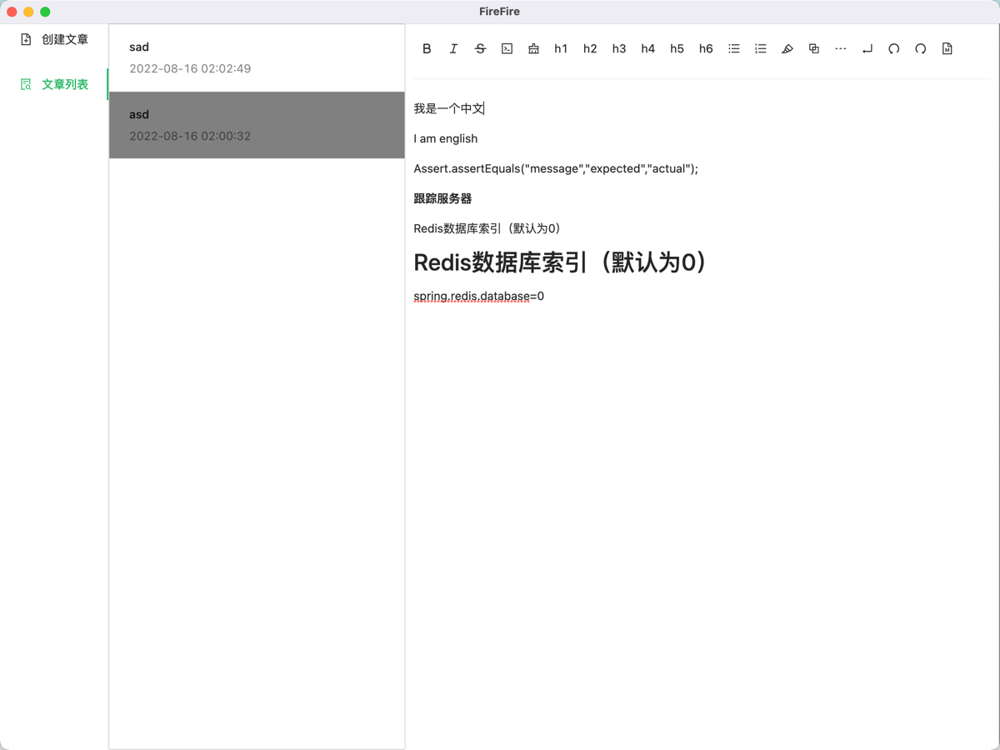
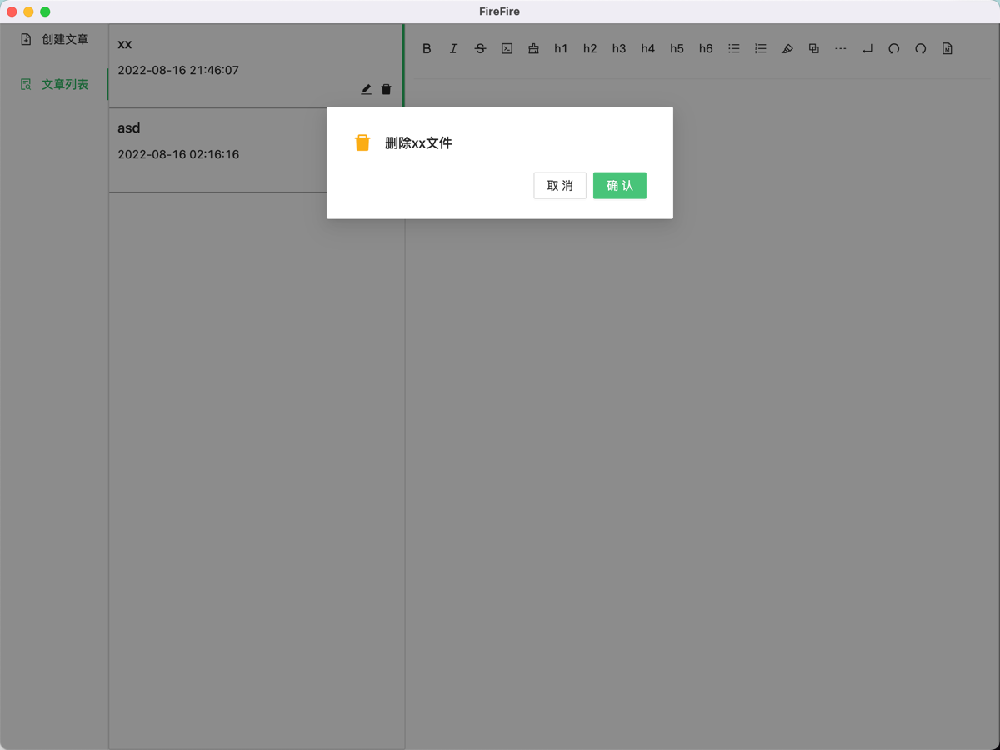
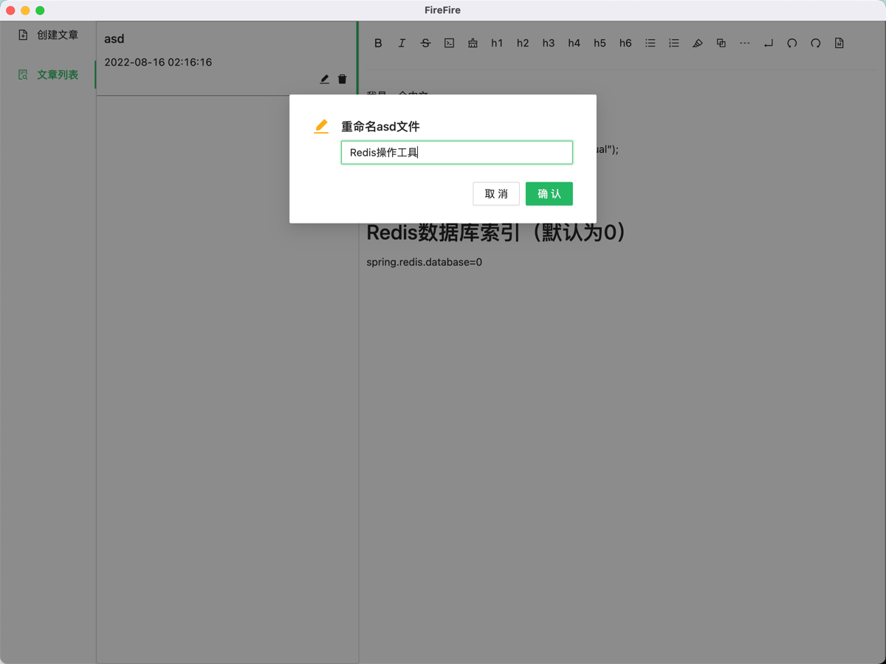

# FireFire
* 一款着力于本地的笔记软件，支持Windows、Mac
* 朝着所见即所得方向发展
* 欢迎提出宝贵意见

# 更新日志
| 概要             | 时间         |
|----------------|------------|
| 支持Markdown基本语法  | 2022-08-07 |
| 支持本地文件操作      | 2022-08-15 |
| 支持Windows、Mac  | 2022-08-16 |
| 支持删除文件、重命名文件  | 2022-08-16 |
| 支持图片的复制 | 2022-08-16 |

# 现已支持
* 支持Markdown基本语法
* 支持本地文件读写、支持创建文件
* 支持Windows、Mac
* 支持删除文件、重命名文件
* 支持图片的复制

# 预计支持
* 导入导出Markdown/HTML文件
* 标签功能
* 标签功能Graph
* 用户自定义设置功能
* 自定义颜色主题选择
* 支持webdav功能
* 支持BiliBili视频链接
* 支持复制Markdown内容，直接可视化展示
* 支持linux端
* 支持截图粘贴

# 界面

## 主界面

## 删除页面

## 重命名页面

