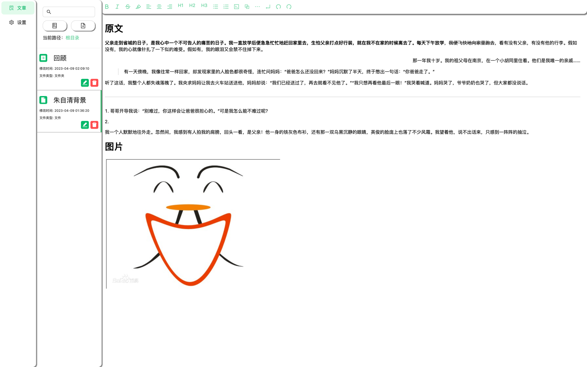

# FireFire
* 一款知识构建的本地笔记软件，支持Windows、Mac、Linux
* 朝着所见即所得方向发展，采用极简主义设计理念
* 基于 Tiptap 编辑器，提供现代化的笔记体验
* 欢迎提出宝贵意见

# 现已支持

## 编辑器功能
* **斜杠命令（Slash Commands）** - 输入 `/` 快速插入内容块
  * 支持标题（H1、H2、H3）
  * 支持列表（有序列表、无序列表、待办事项）
  * 支持代码块、引用、分隔线
  * 支持嵌入内容（BiliBili、YouTube、PDF、网页预览）
  * 支持搜索过滤和键盘导航
* **拖拽排序** - 可视化拖拽调整内容块顺序
* **块级操作菜单** - 删除、复制、移动、转换内容块
* **标签系统** - 使用 `#标签名` 组织笔记
  * 自动提取和索引标签
  * 标签筛选查看相关笔记
  * 支持中英文标签
* **内部链接** - 使用 `[[笔记名称]]` 连接笔记
  * 自动补全笔记名称
  * 链接验证（存在/不存在）
  * 反向链接支持

## 基础功能
* 支持Windows、Mac、Linux三大平台
* 支持本地文件读写、创建文件、删除文件、重命名文件、文件名搜索
* 支持文件夹嵌套管理
* 支持自动保存（可自定义保存间隔）
* **快速笔记** - 一键创建笔记，无需选择文件夹

## Markdown 支持
* 支持 Markdown 基本语法
  * 图片的复制、图片拖动任意位置、截图粘贴
  * 代码块语法高亮（基于 lowlight）
  * 特殊语法自动转换
    * `->`: `→`
    * `>>`: `»`
    * `--`: `—`
    * `1/2`: `½`
    * `!=`: `≠`
  * BiliBili 视频链接嵌入
  * 字体颜色、下划线、高亮
  * 链接地址跳转（支持自动识别）
  * 字体对齐（居中、居左、居右）

## UI/UX
* 极简主义设计风格
  * 中性色调配色方案（灰度 + 品牌绿色 #25b864）
  * 流畅的动画过渡
  * 优化的性能表现
* 暗黑模式支持
* 自定义颜色主题选择
* 用户自定义设置功能
* **自动更新功能** - 自动检测并安装新版本

# 自动更新

FireFire 支持自动检测和安装更新，确保您始终使用最新版本。

## 使用方法
1. **自动检查**：应用启动 3 秒后自动检查更新（可在设置中关闭）
2. **手动检查**：在"设置 > 软件更新"中点击"检查更新"按钮
3. **更新流程**：
   - 检测到新版本时弹出提示
   - 点击"立即更新"开始下载
   - 下载完成后提示重启安装
   - 重启后自动完成更新

## 配置选项
- **自动检查更新**：默认开启，可在设置页面关闭
- **更新源**：使用 GitHub Releases（国内用户如遇下载慢可手动下载）

## 发布说明
查看最新版本和更新日志：[GitHub Releases](https://github.com/coolerwu/FireFire/releases)

# 预计支持

## 未来计划
* 导入导出Markdown/HTML文件
* 标签功能
* 标签功能Graph
* 支持webdav功能
* 支持复制Markdown内容，直接可视化展示
* 接入ChatGPT

# 界面

## 主界面

## 设置页面

# 更新日志
| 概要                               | 时间         |
|----------------------------------|------------|
| 实现快速笔记功能                       | 2025-11-21 |
| 实现内部链接系统（Wiki 风格）           | 2025-11-21 |
| 实现标签系统                          | 2025-11-21 |
| 修复 sidebar 布局问题                 | 2025-11-21 |
| 添加自动更新功能                       | 2025-11-21 |
| 实现嵌入式内容和完成所有 Notion 风格功能    | 2025-11-21 |
| 实现拖拽排序和块级操作菜单               | 2025-11-21 |
| 实现斜杠命令功能（Notion 风格）           | 2025-11-21 |
| 重构 UI 为极简主义风格                  | 2025-11-21 |
| 升级 GitHub Actions 到 v4 版本        | 2025-11-21 |
| 支持字体居中、居左、居右，修复当前路径BUG、支持截图粘贴 | 2023-04-09 |
| 支持保存文件位置、调整页面样式、支持暗黑模式、自动保存、升级版本 | 2023-04-08 |
| 支持文件夹格式                          | 2023-03-27 |
| 优化win、mac安装包体积                   | 2022-08-25 |
| 支持暗黑模式                           | 2022-08-23 |
| 支持Linux                          | 2022-08-22 |
| 支持字体颜色                           | 2022-08-22 |
| 支持链接地址跳转                         | 2022-08-22 |
| 支持文件搜索                           | 2022-08-20 |
| 支持BiliBili视频链接                   | 2022-08-19 |
| 支持代码块语法高亮                        | 2022-08-18 |
| 支持图片拖动任意位置                       | 2022-08-18 |
| 支持图片的复制                          | 2022-08-16 |
| 支持删除文件、重命名文件                     | 2022-08-16 |
| 支持Windows、Mac                    | 2022-08-16 |
| 支持本地文件操作                         | 2022-08-15 |
| 支持Markdown基本语法                   | 2022-08-07 |