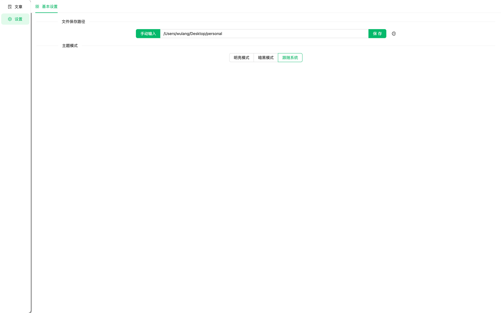

# FireFire
* 一款知识构建的本地笔记软件，支持Windows、Mac、Linux
* 朝着所见即所得方向发展
* 欢迎提出宝贵意见

# 现已支持
* 支持Markdown基本语法
* 支持本地文件读写、支持创建文件、删除文件、重命名文件
* 支持Windows、Mac、Linux
* 支持图片的复制、支持图片拖动任意位置
* 支持代码块语法高亮
* 支持特殊语法
  * `->`: `→`
  * `>>`: `»`
  * `--`: `—`
  * `1/2`: `½`
  * `!=`: `≠`
* 支持BiliBili视频链接
* 支持文件名搜索
* 支持字体颜色
* 支持链接地址跳转
* 支持暗黑模式
* 自动保存
* 支持文件夹
* 用户自定义设置功能
* 自定义颜色主题选择

# 预计支持
* 导入导出Markdown/HTML文件
* 标签功能
* 标签功能Graph
* 支持webdav功能
* 支持复制Markdown内容，直接可视化展示
* 支持截图粘贴
* 支持字体颜色
* 支持字体居中

# 界面

## 主界面

## 设置页面

# 更新日志
| 概要                               | 时间        |
|----------------------------------|-----------|
| 支持保存文件位置、调整页面样式、支持暗黑模式、自动保存、升级版本 | 2023-04-8 |
| 支持文件夹格式                          | 2023-03-27 |
| 优化win、mac安装包体积                   | 2022-08-25 |
| 支持暗黑模式                           | 2022-08-23 |
| 支持Linux                          | 2022-08-22 |
| 支持字体颜色                           | 2022-08-22 |
| 支持链接地址跳转                         | 2022-08-22 |
| 支持文件搜索                           | 2022-08-20 |
| 支持BiliBili视频链接                   | 2022-08-19 |
| 支持代码块语法高亮                        | 2022-08-18 |
| 支持图片拖动任意位置                       | 2022-08-18 |
| 支持图片的复制                          | 2022-08-16 |
| 支持删除文件、重命名文件                     | 2022-08-16 |
| 支持Windows、Mac                    | 2022-08-16 |
| 支持本地文件操作                         | 2022-08-15 |
| 支持Markdown基本语法                   | 2022-08-07 |